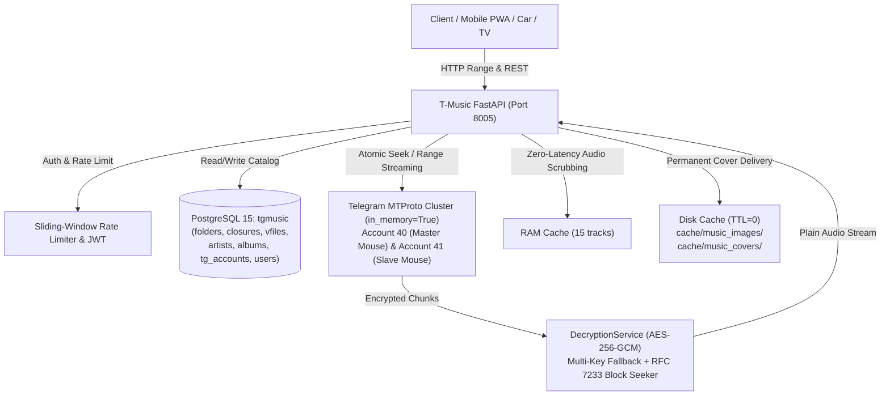

# T-Music: Автономный Веб-Сервис Потокового Воспроизведения Музыки

## 1. Контекст и Цели Проекта
Проект **T-Music** представляет собой самостоятельный, независимый сервис музыкальной витрины и стриминга аудио, выведенный из монолита CloudByte.

### Основные требования реализации:
1. **Отдельная база данных:** Сервис использует выделенную базу данных PostgreSQL `tgmusic` на порту 5433 (не делит таблицы с CloudByte).
2. **Multi-Account кластер Telegram (сессии):** Полная изоляция через MTProto-сессии в оперативной памяти (`in_memory=True`), исключающая ошибку `AuthKeyDuplicated` и конфликты файловых блокировок SQLite при одновременной работе обоих сервисов. Поддержка обоих аккаунтов кластера (Master Mouse 40 и Slave Mouse 41).
3. **True Mid-Stream Failover:** При получении `FloodWait` от Telegram на одном из аккаунтов кластера `FastStreamer` мгновенно и прозрачно переключает поток на зеркальный аккаунт с точностью до байта без остановки воспроизведения.
4. **Потоковая расшифровка AES-256-GCM «на лету»:** 92.1% аудиотеки (57 130 файлов) зашифрованы блочным AES-256-GCM. T-Music расшифровывает чанки потока на лету с поддержкой точной перемотки HTTP Range (RFC 7233) и автоматической поддержкой ротации мастер-ключей шифрования.
5. **Миграция данных и кэшей:** Перенесены дерево каталогов `Music` (5 445 папок), 19 845 связей closure, 62 001 аудиофайл (`vfiles`), 265 артистов, 3 863 альбома, таблица кластера `tg_accounts`, а также 323 МБ кэшей обложек (288 `music_images` и 611 `music_covers`).
6. **Чистая архитектура (No God Objects):** Разделение на слои `api/`, `core/`, `models/`, `repositories/`, `services/`, `tg/`.
7. **Высокий уровень безопасности (Internet-facing):** Защита от brute-force перебора PIN/паролей (блокировка IP на 15 мин), нулевое доверие к URL для защиты от SSRF (блокировка локальных/приватных сетей и AWS metadata), защита от Path Traversal и отсечение опасных форматов (SVG).

---

## 2. Архитектура Системы

---

## 3. Архитектура Потокового Воспроизведения и Расшифровки (Phase 11)

### 3.1. Структура шифрования CloudByte / T-Music
- **32-байтный заголовок файла:**
  - `salt` (16 байт)
  - `base_nonce` (12 байт)
  - `block_size` (4 байта, little-endian, по умолчанию 1 048 576 байт = 1 МиБ)
- **Блоки данных:**
  - Каждый блок = `plaintext_block` + 16 байт GCM authentication tag.
  - Nonce блока вычисляется как `(base_nonce_int + block_idx) mod 2^96` (с fallback на legacy XOR при проверке).
- **Разрешение размеров (Plaintext vs Ciphertext):**
  - Поле `vfiles.size` хранит размер шифротекста в Telegram (например, 9 273 033 байт).
  - Для браузеров и мобильных клиентов эндпоинты `/api/stream/{file_id}` и `/api/stream/tracks/{folder_id}` на лету отдают расчетный `plaintext_size` (например, 9 272 857 байт), гарантируя корректное отображение таймингов и HTTP Range заголовков `Content-Range: bytes START-END/PLAIN_SIZE`.

### 3.2. Стратегия двух мастер-ключей (Key Rotation Management)
- В `music.env` настроены:
  - `ENCRYPTION_RECOVERY_KEY`: текущий primary мастер-ключ (`uUqpUsli+En6g8ex5m9h4UFeFuSsegnOKZawKE18pYw=`).
  - `ENCRYPTION_FALLBACK_KEYS`: исторический мастер-ключ до августовской ротации (`U5e8RtIRjr82BZDzqpcmEh7v6Pay+UdTlZXOg7fWft0=`), которым зашифрованы треки, загруженные ранее (например, альбом Iron Maiden `No Prayer For The Dying`).
- `DecryptionService` при декодировании блока 0 автоматически выполняет пробную расшифровку (multi-key trial). Найденный валидный ключ кэшируется на время жизни стрима, исключая накладные расходы при перемотке.

### 3.3. Точная перемотка зашифрованного потока (HTTP Range Seek)
При запросе Range `bytes=start-end`:
1. `start_block = start // block_size`
2. `plain_offset_in_first_block = start % block_size`
3. `enc_offset = 32 + start_block * (block_size + 16)`
4. `FastStreamer` запрашивает Telegram напрямую со смещения `enc_offset`.
5. `DecryptionService` декодирует блоки, начиная с `start_block`, отсекает `plain_offset_in_first_block` в первом блоке и стримит ровно запрошенное число байт.

### 3.4. Инициализация сессий MTProto и Fernet
Сессионные строки аккаунтов в таблице `tg_accounts` зашифрованы алгоритмом Fernet:
- Ключ Fernet деривируется по стандарту CloudByte: `base64.urlsafe_b64encode(hashlib.sha256(SESSION_SECRET.encode()).digest())`.
- В `app.tg.manager.decrypt_session_string` используется идентичная деривация, что гарантирует успешную распаковку сессий Pyrogram без ошибки `unpack requires a buffer of 271 bytes`.
- В `FastStreamer.stream_file` добавлена строгая проверка готовности кластера с автоматическим стартом до вызова `get_candidate_sources`.

---

## 4. Компоненты Системы

### 4.1. Бэкенд (FastAPI, Python 3.13)
- **`app.core.config`:** Настройки Pydantic Settings из `music.env` (`SESSION_SECRET`, `ENCRYPTION_RECOVERY_KEY`, `ENCRYPTION_FALLBACK_KEYS`).
- **`app.core.database`:** Пул соединений к базе `tgmusic`.
- **`app.core.security`:** Хэширование паролей (bcrypt), хэширование PIN (SHA-256 с солью `SECRET_KEY`), JWT токены.
- **`app.core.rate_limiter`:** Потокобезопасный ограничитель частоты запросов со скользящим окном и таймером блокировки.
- **`app.models`:** Чистые SQLAlchemy-модели (`TGAccount`, `Folder`, `FolderClosure`, `VFile`, `MusicArtist`, `MusicAlbum`, `AppUser`).
- **`app.repositories`:** Чистый слой доступа к данным:
  - `ArtistRepository`: выборка артистов с предзагрузкой альбомов (`selectinload`) для предотвращения проблемы N+1 запросов.
  - `AlbumRepository`: выборка и фильтрация альбомов по типам (album, single, ep, compilation, live).
  - `FileRepository`: получение треков с естественной сортировкой (Natural Sort по track number/filename).
- **`app.services`:**
  - `AuthService`: логика входа по паролю или PIN, учет неудачных попыток и выдача JWT.
  - `DecryptionService`: потоковая расшифровка AES-256-GCM, парсинг 32-байтных заголовков, multi-key fallback, Range seek.
  - `StreamService`: разбор Range-запросов (RFC 7233), сквозная интеграция с `DecryptionService`, расчет `plain_size`, кэш заголовков и RAM буфер.
  - `CoverCacheService`:
    - Канонический алгоритм хэширования CloudByte: `hashlib.sha1(normalized_url).hexdigest()[:32]`.
    - Поддержка чтения кэшей в форматах `{key}.bin` и `{key}.meta`.
    - Асинхронный DNS-резолвинг без неподдерживаемых флагов aiohttp.
    - Защита от SSRF (отсечение IPv4/IPv6 private/loopback диапазонов), magic bytes валидация (JPEG, PNG, WebP).
  - `MusicLibraryService`: построение безопасных URL для обложек через `urllib.parse.quote(url, safe="")`, получение статистики каталога, списков артистов и альбомов.
  - `RamCacheService`: кольцевой буфер активных треков в оперативной памяти.
- **`app.tg`:**
  - `TelegramManager`: управление multi-account кластером, параллельная инициализация в памяти (`in_memory=True`), корректная Fernet-дешифрация сессий, отслеживание `FloodWait` по аккаунтам.
  - `FastStreamer`: парсинг `account_map`, сборка логических частей, atomic pre-fetch чанков и True Mid-Stream Failover на зеркала.

### 4.2. Фронтенд (React 18 + Vite, Zine Dark Theme)
- **`MusicLibrary.jsx`:**
  - Синхронизация жизненного цикла с хуком авторизации: мгновенная автоматическая перезагрузка каталога при вводе PIN-кода.
  - Раздельные представления: круглые карточки исполнителей с бэджами релизов и квадратные обложки релизов/альбомов с кнопкой быстрого воспроизведения.
  - Вкладка «Альбомы»: прямой поиск и просмотр всех 3 863 релизов с быстрым воспроизведением любого альбома в один клик.
- **`MusicLibraryPlayer.jsx`:** Компактный мини-плеер снизу + полноэкранный Now Playing экран с очередью воспроизведения.
- **`CoverPicker.jsx`:** Смена обложек через Drag & Drop или защищённый URL.
- **`AuthModal.jsx`:** Сенсорный цифровой PIN-пад с защитой от перебора.
- **`playerStore.js`:**
  - Очередь треков, режимы shuffle/repeat, громкость.
  - **Background Pre-caching:** при достижении 75% трека фоновый `fetch` первых 2 МБ следующих 2 треков из очереди для мгновенного перехода без задержек.
- **`mediaSession.js`:** Поддержка Media Session API для системных экранов блокировки iOS, Android и мультимедиа автомобилей.

---

## 5. Результаты Миграции и Верификации

1. **Миграция данных (`migrate_data.py`):**
   - 5 445 папок и 19 845 замыканий closure перенесены в `tgmusic`.
   - 62 001 файл `vfiles` перенесен со всеми параметрами чанков `msg_ids` и `account_map`.
   - 2 аккаунта кластера (`tg_accounts`: Master Mouse 40 и Slave Mouse 41) перенесены в `tgmusic`.
   - 265 артистов и 3 863 альбома перенесены без потерь.
   - 288 файлов `music_images` и 611 файлов `music_covers` скопированы в `tmusic/cache/`.
2. **Сквозная проверка стриминга и расшифровки:**
   - Воспроизведение зашифрованного трека `20098 02 Holy Smoke.mp3` с отдачей HTTP 206 Partial Content, валидного заголовка ID3v2 (`b'ID3...'`) и Content-Range `bytes 0-65535/9272857`.
   - Проверка произвольной перемотки (Range Seek) на 1 500 000 байте с мгновенной отдачей 32 768 байт расшифрованного аудиопотока.
   - Проверка выдачи метаданных треков `/api/stream/tracks/1572` с корректными plaintext-размерами для 14 треков альбома.
3. **Отображение карточек артистов и обложек:**
   - `GET /api/library/albums` возвращает каталог альбомов с пагинацией и метаданными.
   - `GET /api/library/cover?url=...` корректно отдает локальные кэшированные файлы `.bin` с правильными Content-Type заголовками (проверено на реальной обложке 2.79 MB).
4. **Тестирование бэкенда (`pytest`):**
   - 16/16 тестов успешно пройдены (расшифровка AES-256-GCM, парсинг 32-байтных заголовков, расчет plaintext-размеров, Range-заголовки, деривация Fernet, PIN-аутентификация, блокировка brute-force, репозитории и API).
5. **Сборка фронтенда (`vite build`):**
   - Успешная сборка бандла в `tmusic/frontend/dist` без ошибок компиляции (277 kB JS, 1.47 kB CSS).
6. **Безопасность CloudByte:**
   - Файлы `app.env`, `backend/`, `frontend/` монолита CloudByte **не модифицировались**.
